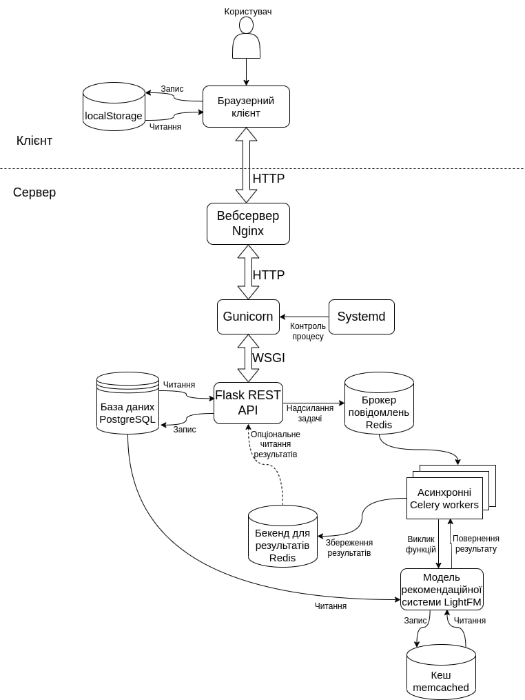

MediaRater is a system for user feedback creation for media content (movies, books, TV-shows etc). This service also performs visualization of statistics for the media product based on information about users provided while creating an account. It is also able to suggest products that could potentially interest a user using a recommender system with collaborative filtering approach.

The architecture of the application can be summarised as follows:

